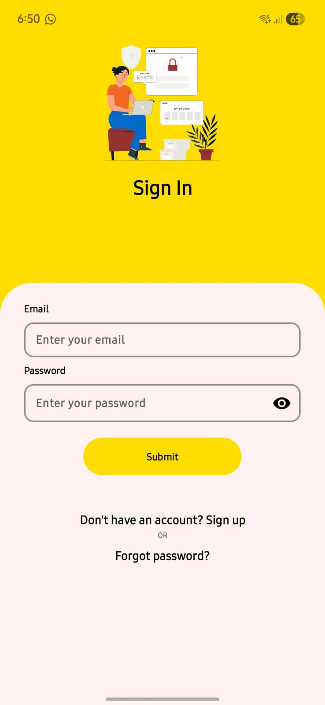
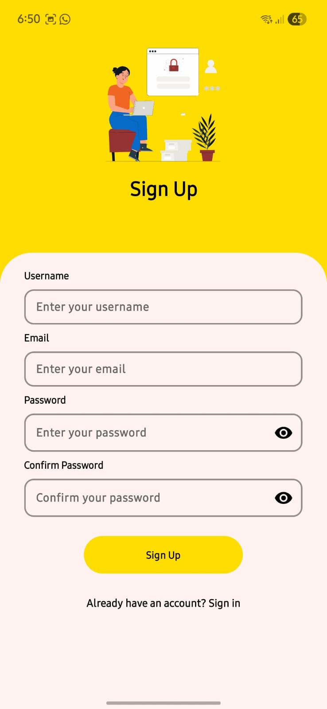
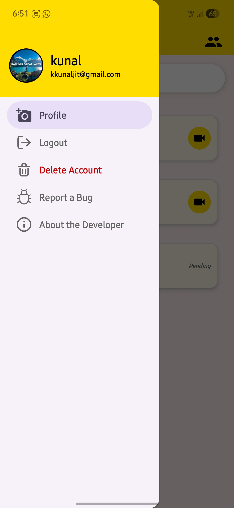
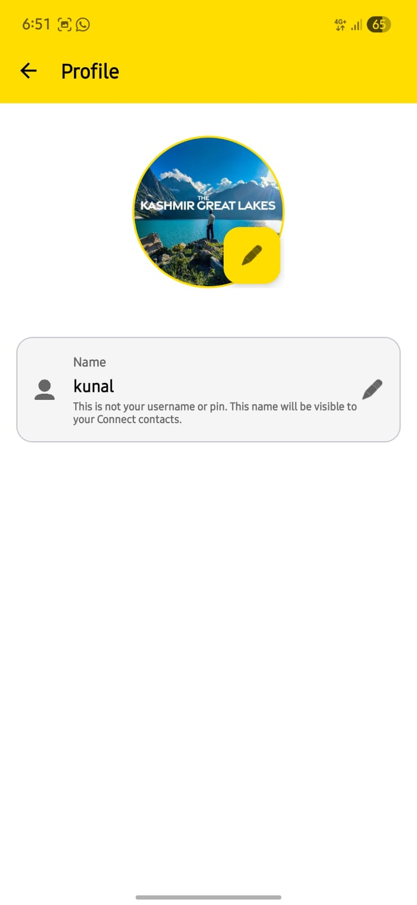
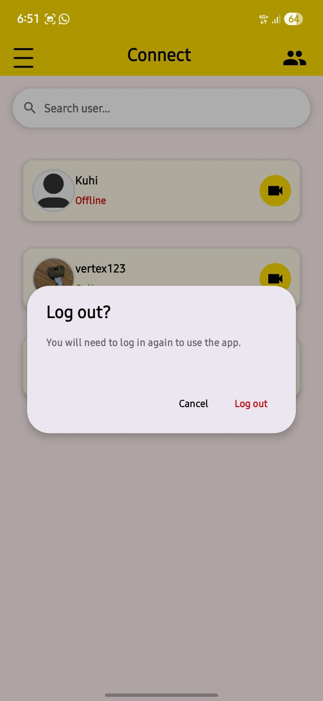
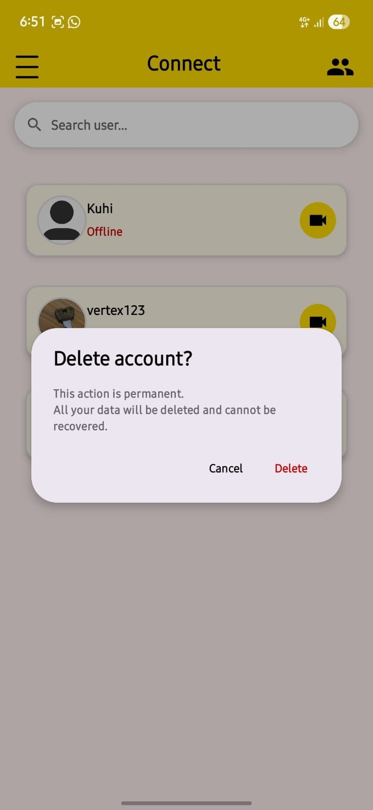
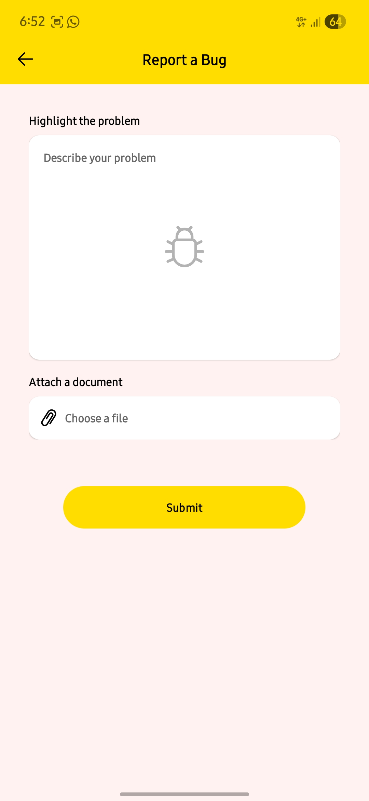

# 🚀 Connect - Modern Video Calling & Social Networking

> **Connect** is a modern Android application designed to enable seamless real-time video communication and social networking. Built with performance, simplicity, and a clean user experience.

---

## 📱 App Preview

### 🔐 Authentication

<p align="center">
  
  
  
</p>

- Secure Firebase authentication  
- Clean login & signup UI  
- Password visibility toggle  
- Email-based password reset  

---

### 🏠 Main Interface

<p align="center">
  
  
</p>

- Real-time user status (Online/Offline)  
- One-click video calling  
- Smooth and modern UI  

---

### ⚠️ User Actions

<p align="center">
  
  
</p>

- Secure logout confirmation  
- Permanent account deletion dialog  

---

### 🐞 Report & About

<p align="center">
  
  
</p>

- Bug reporting system  
- Developer profile section  

---

## ✨ Key Features

- 📹 Real-Time Video Calling (WebRTC)  
- 🖥️ Screen Sharing  
- 🤝 Friend Request System  
- 🛡️ Block & Unfriend Users  
- 🌓 Light & Dark Mode  
- 🔔 Real-Time Updates  
- 👤 Profile Customization  

---

## 🛠️ Tech Stack

- **Language**: Kotlin  
- **UI**: XML + Material Components  
- **RTC**: WebRTC  
- **Backend**: Firebase  
  - Authentication  
  - Firestore  
- **Storage**: Cloudinary  
- **Build Tool**: Gradle  

---

## 🧠 Architecture

- MVVM Architecture  
- Clean and modular code structure  
- Real-time signaling with Firestore  

---

## 📂 Project Structure
Connect/
├── app/
│ ├── adapter/
│ ├── model/
│ ├── webrtc/
│ ├── ui/
│ └── utils/
├── res/
│ ├── layout/
│ ├── drawable/
│ └── values/
├── build.gradle.kts
└── settings.gradle.kts

---

## 🚀 Getting Started

### 🔧 Prerequisites

- Android Studio Flamingo+  
- JDK 17+  
- Firebase Account  

---

### ⚙️ Setup

1. Clone the repository:
```bash
git clone https://github.com/kunaljit3006/Connect.git
Firebase setup:
Create project in Firebase Console
Add Android app
Download google-services.json
Place it inside /app
Enable:
Email/Password Authentication
Firestore Database
Run the app
📊 Future Improvements
Voice Calls
Push Notifications (FCM)
Media Sharing
Multi-language Support
AI-based Features
🤝 Contributing
1. Fork the repo
2. Create a branch
3. Make changes
4. Push
5. Open Pull Request
📧 Contact

Developer: Kunaljit Kashyap
📩 Email: kkunaljit@gmail.com

🔗 GitHub: https://github.com/kunaljit3006

🔗 LinkedIn: https://linkedin.com/in/kunaljit-kashyap-8bb212287

📄 License

MIT License

<p align="center"> Made with ❤️ by Kunaljit Kashyap </p> ```
